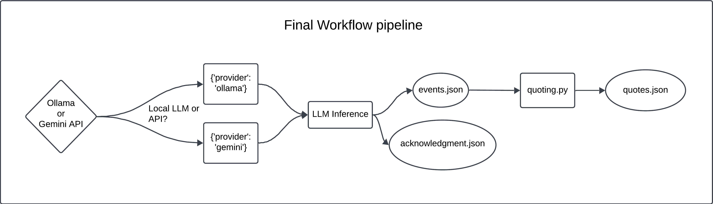
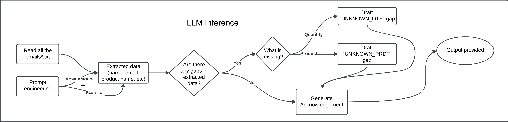

# Project Documentation: AI Email Inquiry Processing Workflow

**Date**: October 7, 2025

**Author**: Amey Tonannavar

## 1. Project Overview

The document provides a comprehensive overview of the AI workflow designed to automate the processing of customer inquiry emails. The primary objective was to design a deterministic AI system that ingests raw unstructured emails, produces structered data, drafts a concise acknowledgment, and emits a price quote as a JSON artifact. Key constraints included the ability to run offline and lightweighted dependencies. LLM adaptation is added to provide better performance.

## 2. Architectural Evolution

The project's architecture evolved significantly from it's initial conception to its final form, moving from purely rule-based system to a flexible, dual-pipeline approach that incorporates LLMs.

### 2.1. Initial Approach: The Lightweight Offline Pipeline

The initial design strictly adhered to the "minimal" and "offline" constraints. The core of this pipeline was a rule-based parser (`fuzzyparsing_pipeline.py`) that used fuzzy string matching (Levenshtein distance) to identify products and regular expressions to extract quantities and sender details.

- **What was done**: A sequential, three-stage workflow was implemented:

  1. **Parse**: The `EmailParser` module would clean the email body and use `thefuzz` library to find the best product matches.

  2. **Acknowledge**: A rule-based `AcknowledgmentGenerator` would craft responses based on the specific gaps (e.g., `MISSING_QUANTITY`) identified by the parser.

  3. **Quote**: A deterministic `QuoteGenerator` would perform all financial calculations.

- **Strengths**: Fast, lightweight, and worked completely offline without any external dependencies.

- **Weaknesses**: This approach revealed a critical flaw in relying solely on lexical similarity, which became a major challenge (detailed in Section 4).

### 2.2. The Pivot: LLM-Based Pipeline

Upon receiving clarification that the use of LLMs was permitted, the architecture was re-envisioned to prioritize accuracy and semantic understanding. This led to the development of the `llm_pipeline.py`.

- **What was done**: The `parsing` and `acknowledgment` modules were replaced by a single, powerful `llm_interface` module. This new module uses a "one-shot" prompt to instruct an LLM to perform both structured data extraction and acknowledgment drafting in a single inference step.

- **Strengths**: Dramatically improved accuracy, resilience to varied email phrasing, and the ability to generate more nuanced and context-aware responses.

- **Weaknesses**: The reliability of the output is highly dependent on the model's capability. Smaller local models (e.g., `Llama3:8B`) can sometimes "hallucinate" or fail to strictly adhere to the requested JSON schema, occasionally omitting fields like `gaps_identified` even when gaps are present in the source email. This necessitates a robust validation layer.

**Final Architecture**: The project now supports both pipelines, allowing the user to choose between the high-accuracy LLM approach (recommended with powerful models or APIs) and the original lightweight model, providing a robust and flexible solution.

## 3. Final Pipeline Flowchart (LLM-Based)

The final, recommended architecture follows an Infer -> Validate -> Execute model, which ensures both high accuracy from the LLM and perfect reliability from the deterministic downstream modules.

### Final Workflow pipeline (LLM)

### LLM inference flow `llm_inferencing.py` & `llm_interface.py`

## 4. Challenges Faced & Solutions

Several challenges were encountered during development, each leading to significant improvements in the final design.

### 1. Challenge: False Positives in Fuzzy Matching

- **Problem**: The initial lightweight pipeline produced a high number of false positives. The Levenshtein distance algorithm, which only measures character-level similarity, would incorrectly match common words to products (e.g., the word **"hello"** was being matched with a high score to "Dell Laptop"). This made the parser unreliable.

- **Solution**: This was the primary catalyst for adopting the LLM-based pipeline. An LLM's semantic understanding completely eliminates this category of error, as it understands that **"hello"** and **"Dell"** are contextually unrelated.

### 2. Challenge: Ensuring Deterministic Outputs

- **Problem**: While powerful, LLMs can be non-deterministic and are not suitable for tasks requiring perfect precision, such as financial calculations. Asking an LLM to calculate a quote could lead to mathematical errors.

- **Solution**: A clear separation of concerns was established. The LLM is used exclusively for language understanding and generation. All mathematical calculations (pricing, discounts, taxes) are handled by a separate, fully deterministic Python module (`src/quoting.py`). This hybrid approach combines the strengths of both technologies.

### 3. Challenge: Dependency and Connectivity Trade-offs

- **Problem**: While powerful, both LLM options compromise the original project constraints. The Gemini API requires an active internet connection, violating the "offline" requirement. The local Ollama model, while offline, requires a large model download and significant dependencies (`requests`), conflicting with the "lightweight" goal.

- **Solution**: The project was structured with dual pipelines, allowing the user to consciously choose which set of trade-offs they prefer: the high accuracy of the LLM pipeline or the true offline, lightweight nature of the original fuzzy-parsing pipeline.

## 5. Future Enhancements

The current workflow is robust, but several enhancements could further improve its capabilities.

### 1. Automated Email Sending:

- Integrate with an email service provider (like SendGrid or Amazon SES) to automatically send the generated acknowledgment drafts and final quotes, closing the loop on the automation.

### 2. Multi-Language Support:

- Leverage the multilingual capabilities of modern LLMs to extend the workflow to process inquiry emails in other languages, such as Spanish or French, without needing to write language-specific parsing rules.

### 3. Advanced Contextual Understanding:

- Enhance the prompt to handle conversation history. By including the context of previous emails in the prompt, the LLM could understand follow-up questions and requests for quote revisions.

### 4. Semantic Search for Lightweight Pipeline:

- Enhance the `fuzzyparsing_pipeline.py` by replacing the Levenshtein-based fuzzy matching with a lightweight, offline sentence-transformer model. By creating vector embeddings for the product catalog, the system could perform a semantic search, allowing it to understand context (e.g., matching "portable storage" to "External Hard Drive") without the overhead of a full LLM. This would offer a powerful middle ground between the two existing pipelines.
